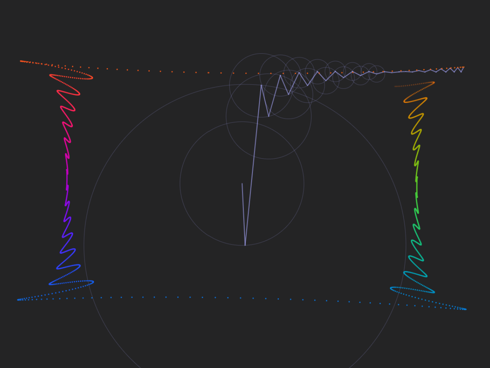

# 傅里叶变换绘图-网页版-v4
--------------------------------------
- Version: 2025.03-v4
- <del>Online website: <https://www.xcreate.cool/test/imgtest/imgDraw.html></del>
- Presentation Video: [BV1cY411u7jU](https://www.bilibili.com/video/BV1cY411u7jU?spm_id_from=333.999.0.0&vd_source=09a1b1eba90b464c2c46c4c894480343)

### 1、文件结构

- `front-end` 前端代码
- `py-back-end`后端python代码
- `img` 一些测试过程的图片

### 2、测试方法

- 安装好python依赖后，运行`py-back-end`中的`server.py`,之后浏览器打开`imgDraw.html`即可。
  
### 3、功能

- 加载图片后经过一系列分析即可绘图
- 支持降采样重绘

### 4、分析流程

$$\begin{CD}
  原图 @>canny边缘提取>> 边缘二值图 @> 带惯性的深度优先搜索 >> 连通路径序列 @> 蚁群优化处理 >> 尽量短的欧拉回路 @> 一维离散傅里叶变换 >> 用于绘图的频谱序列
\end{CD}$$

